<div align="center">
  <!-- Clean Transparent Header Title -->
  <a href="https://github.com/vishvjeettanwar1623" target="_blank" rel="noopener noreferrer">
    
  </a>

  <!-- Dynamic Subtitle -->
  <a href="https://github.com/vishvjeettanwar1623" target="_blank" rel="noopener noreferrer">
    
  </a>

  <br />

  <!-- GitHub & Social Badges -->
  <a href="https://github.com/vishvjeettanwar1623" target="_blank" rel="noopener noreferrer">
    
  </a>
  &nbsp;
  <a href="https://github.com/vishvjeettanwar1623?tab=repositories" target="_blank" rel="noopener noreferrer">
    
  </a>
  &nbsp;
  <a href="mailto:sbvj727@gmail.com" target="_blank" rel="noopener noreferrer">
    
  </a>
  &nbsp;
  <a href="https://www.linkedin.com/in/vishvjeettanwar" target="_blank" rel="noopener noreferrer">
    
  </a>
</div>

<br />

---

### 👨‍💻 About Me

```zsh
⚡ vishvjeet@dev:~$ cat profile.json
{
  "name": "Vishvjeet Singh Tanwar",
  "handle": "@vishvjeettanwar1623",
  "roles": [
    "Builder & Designer",
    "Full Stack Developer - MERN",
    "Blockchain Builder"
  ],
  "tech_stack": [
    "MongoDB", "Express", "React", "Node.js",
    "TypeScript", "Solidity", "Python"
  ],
  "email": "sbvj727@gmail.com"
}
```

---

### 🛠️ Tech Stack & Skills

<div align="center">
  <!-- Crisp SkillIcons Grid Render -->
  
</div>

---

### 🏆 GitHub Achievements & Badges

<div align="center">
  <a href="https://github.com/vishvjeettanwar1623?tab=achievements" target="_blank" rel="noopener noreferrer">
    
  </a>
  &nbsp;&nbsp;&nbsp;&nbsp;
  <a href="https://github.com/vishvjeettanwar1623?tab=achievements" target="_blank" rel="noopener noreferrer">
    
  </a>
  &nbsp;&nbsp;&nbsp;&nbsp;
  <a href="https://github.com/vishvjeettanwar1623?tab=achievements" target="_blank" rel="noopener noreferrer">
    
  </a>
  &nbsp;&nbsp;&nbsp;&nbsp;
  <a href="https://github.com/vishvjeettanwar1623?tab=achievements" target="_blank" rel="noopener noreferrer">
    
  </a>
</div>

---

### 🚀 Featured Repositories

| Repository | Stack | Description |
| :--- | :---: | :--- |
| ⚡ [**`lagline`**](https://github.com/vishvjeettanwar1623/lagline) | `TypeScript` | High-performance latency analysis & system performance monitoring tool. |
| 📧 [**`gmailHandler`**](https://github.com/vishvjeettanwar1623/gmailHandler) | `TypeScript` | Automated Gmail API integration & workflow email processing engine. |
| 🛠️ [**`patchwork`**](https://github.com/vishvjeettanwar1623/patchwork) | `JavaScript` | Git history synchronization, backdating CLI, & contribution manager. |
| 🤖 [**`friday`**](https://github.com/vishvjeettanwar1623/friday) | `Python` | Developer automation utilities, assistant tools, & system scripts. |
| 🌐 [**`web-dev-projects`**](https://github.com/vishvjeettanwar1623/web-dev-projects) | `HTML` / `CSS` | Showcase of modern web development projects & interactive interfaces. |

---

### 📊 Real-Time Metrics & Activity

<div align="center">
  <!-- GitHub Streak Badge -->
  <a href="https://github.com/vishvjeettanwar1623" target="_blank" rel="noopener noreferrer">
    
  </a>

  <br /><br />

  <!-- Animated GitHub Contribution Matrix (Clean SVG, No Text Header) -->
  <a href="https://github.com/vishvjeettanwar1623" target="_blank" rel="noopener noreferrer">
    
  </a>
</div>
