<div align="center">
  <!-- Clean Transparent Header Title (Animates Once & Stays Static) -->
  <a href="https://github.com/vishvjeettanwar1623" target="_blank" rel="noopener noreferrer"></a>

  <!-- Dynamic Subtitle -->
  <a href="https://github.com/vishvjeettanwar1623" target="_blank" rel="noopener noreferrer"></a>

  <br /><br />

  <!-- Animated Contribution Matrix -->
  <a href="https://github.com/vishvjeettanwar1623" target="_blank" rel="noopener noreferrer"></a>
</div>

<br />

<hr style="border: 0; height: 1px; background: #30363d;" />

###  About Me

```zsh
⚡ vishvjeet@dev:~$ cat profile.json
{
  "name": "Vishvjeet Singh Tanwar",
  "handle": "@vishvjeettanwar1623",
  "roles": [
    "Builder & Designer",
    "Full Stack Developer - MERN",
    "Blockchain Builder"
  ],
  "tech_stack": [
    "MongoDB", "Express", "React", "Node.js",
    "TypeScript", "Solidity", "Python"
  ],
  "email": "sbvj727@gmail.com"
}
```

<hr style="border: 0; height: 1px; background: #30363d;" />

###  Dev Setup & Environment

```zsh
⚡ vishvjeet@dev:~$ neofetch --dev-setup
{
  OS        : Windows / Linux; 
  EDITOR    : VS Code / Antigravity;
  TERMINAL  : Windows Terminal / Git Bash;
  TOOLING   : Node.js (pnpm/bun), Git, Docker, Python;
  WEB3      : Solidity, Hardhat, Ethers.js;
  DEPLOY    : Vercel, Netlify, Docker Containers;
}
```

<hr style="border: 0; height: 1px; background: #30363d;" />

###  Tech Stack & Skills 

#### 🌐 Core Languages


#### ⚛️ Frontend & UI Frameworks


#### ⚙️ Backend, Databases & APIs


#### 🛠️ DevOps, Systems & Developer Tools


<hr style="border: 0; height: 1px; background: #30363d;" />

###  Badges

<div align="center">
  <a href="https://github.com/vishvjeettanwar1623?tab=achievements" target="_blank" rel="noopener noreferrer"></a>
  <a href="https://github.com/vishvjeettanwar1623?tab=achievements" target="_blank" rel="noopener noreferrer"></a>
  <a href="https://github.com/vishvjeettanwar1623?tab=achievements" target="_blank" rel="noopener noreferrer"></a>
</div>

<hr style="border: 0; height: 1px; background: #30363d;" />

###  Featured Repositories

| Repository | Stack | Description |
| :--- | :---: | :--- |
| [**`LagLine`**](https://github.com/vishvjeettanwar1623/lagline) |  | A desktop dashboard that scans your local repos and shows their sync status against remote at a glance. |
| [**`Vaxis`**](https://github.com/vishvjeettanwar1623/vaxis) |  | A local-first dev memory engine that indexes your codebase into a semantic graph in an Obsidian vault, giving AI tools persistent project context via MCP. |
| [**`EgoArena`**](https://github.com/vishvjeettanwar1623/egoArena) |  | A 10-question quiz that turns your personality into a Character Card, then throws it into AI-simulated 1v1 battles on an Elo leaderboard. |
| [**`Hexecute`**](https://github.com/vishvjeettanwar1623/hexecute) |  | Stake tokens, solve a live coding challenge, get AI-graded, and let your fighter settle the score on-chain. |
| [**`Data-Roots`**](https://github.com/vishvjeettanwar1623/Data-Roots) |   | Decentralized data sharing on the blockchain — upload to IPFS, register on-chain, and grant or revoke access with fine-grained control. |

<hr style="border: 0; height: 1px; background: #30363d;" />

###  Real-Time Metrics & Activity

<div align="center">
  <!-- GitHub Streak Badge -->
  <a href="https://github.com/vishvjeettanwar1623" target="_blank" rel="noopener noreferrer"></a>
</div>

<hr style="border: 0; height: 1px; background: #30363d;" />

###  Connect

<div align="center">
  <a href="https://github.com/vishvjeettanwar1623" target="_blank" rel="noopener noreferrer"></a>
  <a href="https://www.linkedin.com/in/vishvjeettanwar" target="_blank" rel="noopener noreferrer"></a>
  <a href="mailto:sbvj727@gmail.com" target="_blank" rel="noopener noreferrer"></a>
</div>
